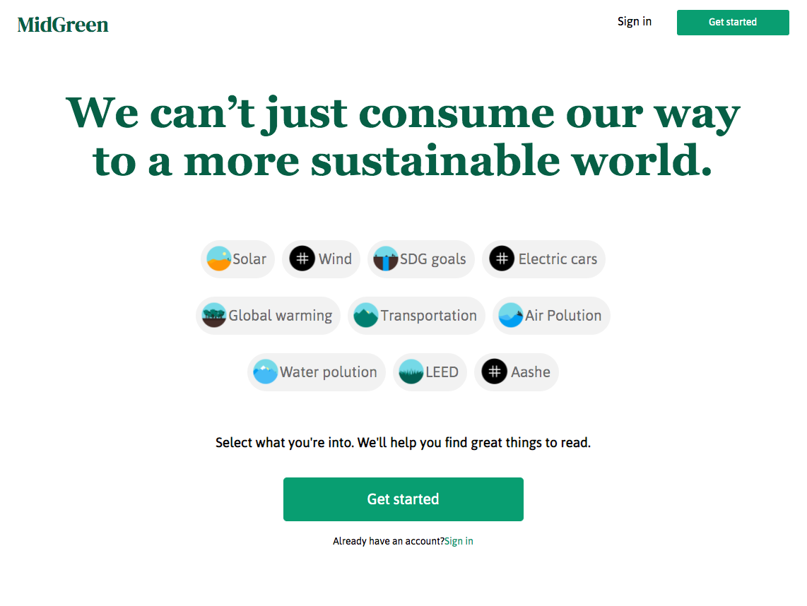
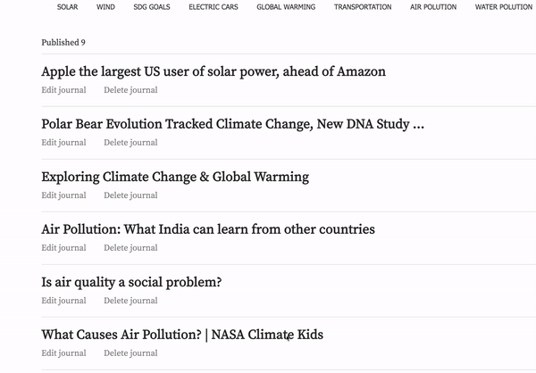
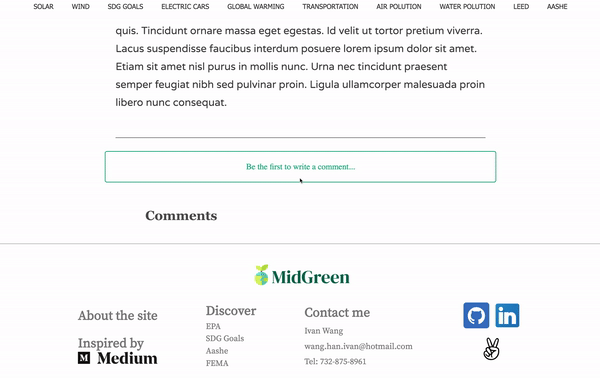
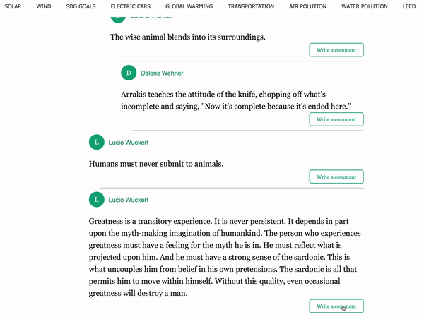

# Midgreen

[Midgreen](https://midgreen.herokuapp.com/) is a sustainability journalism website mimics [Medium](https://medium.com) functionalities built with Ruby on Rails, React, Redux.

[](https://midgreen.herokuapp.com/)

[](https://github.com/RichardLitt/standard-readme)


## Table of Contents

- [Technologies](#technology)
- [Key Features](#features)
    - [Midgreen Categories](#profiles)
    - [Midgreen Journals](#friending)
    - [Midgreen Comments](#newsfeed)
- [Code Snippets](#snippets)
- [License](#license)
- [Design Documents](https://github.com/emikyu/Nekobook/wiki)

## Technology

Following technologies were used on this fullstack project: [Ruby on Rails](https://api.rubyonrails.org/), [Redux](https://redux.js.org/api/api-reference), [React](https://reactjs.org/docs/getting-started.html), [PostgreSQL](https://www.postgresql.org/), [AWS S3](https://docs.aws.amazon.com/s3/index.html), and [Heroku](https://devcenter.heroku.com/categories/reference).

## Features

Midgreen consists of following highlighted features:
1. [Midgreen Categories](#profiles)
2. [Midgreen Journals](#friending)
3. [Midgreen Comments](#newsfeed)

Additional functionalities have also been implemented: splash page, user authentication and error handling, user profile.

### Categories
Each category has its own journals
- User could browse through categories as they wish to explore the topic that they interest in:


- Journals are under different categories


### Journals
- Users could check their published journals


- User could write new journals and upload new pictures to AWS storage.


- Users could edit their own journals,change photo, title, content, and category as they like.




### Comments
- Users can publish comments:



- Users could publish comments on other people's comments to create a interactive experience.



## Code Snippets

To find all child comments and display them properly, initial approach was to iterate through all comments to find parent comment first, then iterate through all comments again to find children comments. The time complexity of this approach is O(n^2)algorithm.

After fetching all comments from the journal, I used hash look up where the keys are parent comment ids, and the values are children comments. In this way, the time complexity of the whole process is O(n) + O(1).


``` Ruby
    def comments_by_parent
        comments_by_parent = Hash.new { |hash, key| hash[key] = [] }

        self.comments.includes(:parent_comment).each do |comment|
            comments_by_parent[comment.parent_comment_id] << comment
        end

        comments_by_parent
    end
```

When displaying the nested comments, because the lookup speed is significantly increased, I just need to iterate through all the parent comments then loop through all the children comments.

``` Ruby
    const nestedComments = (allComments[comment.id] || []).map((comment) => {
      return (
        <CommentList
          key={comment.id}
          journalId={journalId}
          comment={comment}
          allComments={allComments}
          comment_authors={comment_authors}
        />
      );
    });
```

I also gave children comments default style so difference them between parent comments.
``` Ruby
<div
          className="child-comments"
          style={{
            marginLeft: "25px",
            marginTop: "10px",
            borderTop: "1px solid rgba(0, 0, 0, 0.3)",
          }}
        >
          {nestedComments}
        </div>
```

## Design Documents

[Design Documents](https://github.com/IvanGit911/MidGreen/wiki)

## License

© 2020 Ivan Wang


